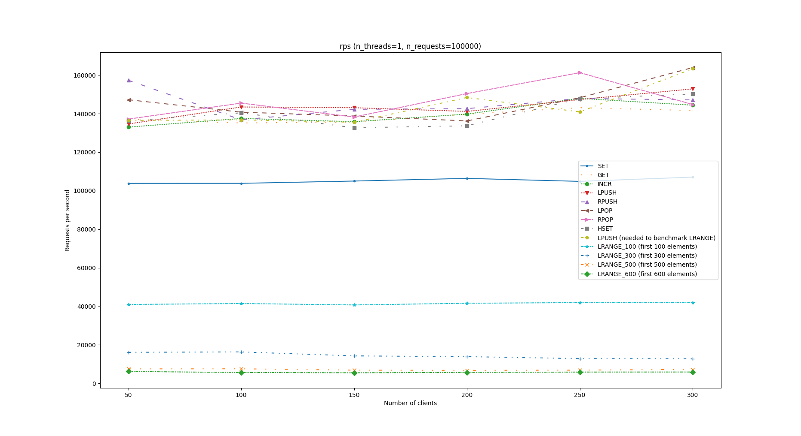
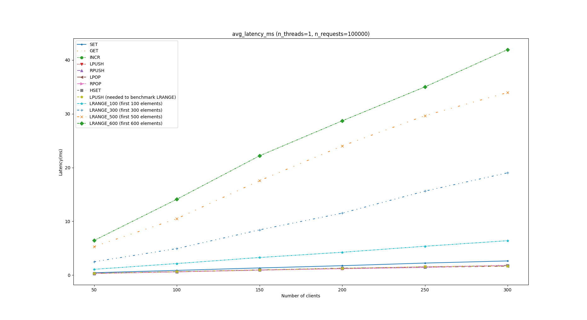
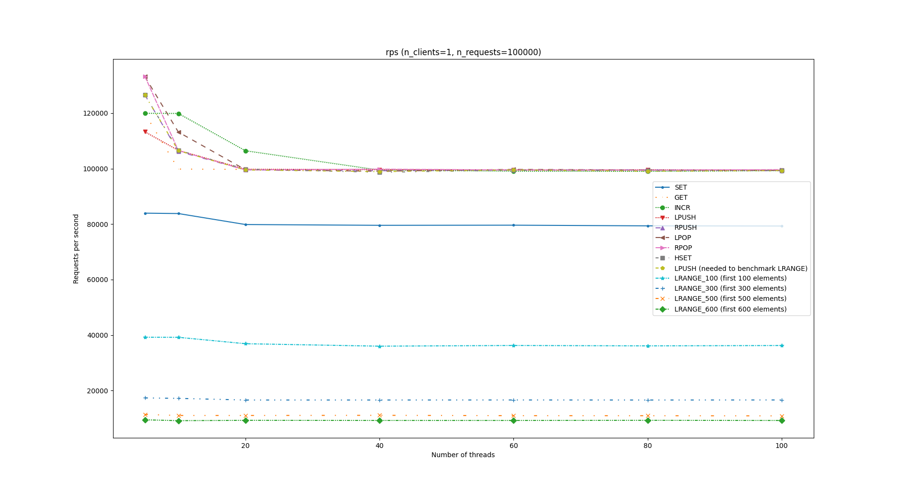
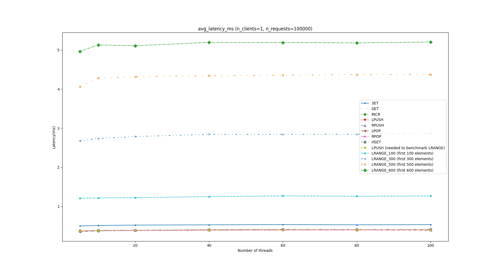

# LiteKV

LiteKV is a simple key-value storage implementation. 

---

### Build

```bash

mkdir build
cd build
cmake ..
make
```

### Supported data types
* integer
* string
* list
* hash
* set

### Supported modes
* Pub/Sub

### Supported persistence
* AOF
* LiteKV Binary Format

### Supported Commands

<table>
  <tr>
  </tr>     
  <tr>         
    <th align="center">Type</th>
    <th align="center">Command</th>
    <th align="center">Usage</th>
    <th align="center">Description</th>     
  </tr>
  <tr>
    <td rowspan="8" align="center"> <b>Generic</b> </td>
  </tr>
  <tr>
    <td align="center"> ping </td>
    <td align="center"> ping </td>
    <td align="center"> Ping the server </td>
  </tr>
  <tr>
    <td align="center"> del </td>
    <td align="center"> del key [key...]</td>
    <td align="center"> Remove the specified keys </td>
  </tr>
  <tr>
    <td align="center"> exists </td>
    <td align="center"> exists key [key...]</td>
    <td align="center"> Return if specified keys exist </td>
  </tr>
  <tr>
    <td align="center"> type </td>
    <td align="center"> type key　</td>
    <td align="center"> Return data type of specified key </td>
  </tr>

  <tr>
    <td align="center"> expire </td>
    <td align="center"> expire key seconds </td>
    <td align="center"> Set expiration for key </td>
  </tr>

  <tr>
      <td align="center"> expireat </td>
      <td align="center"> expireat key unix-timestamp </td>
      <td align="center"> Set key expire in unix-timestamp </td>
    </tr>
    
  <tr>
    <td align="center"> ttl </td>
    <td align="center"> ttl key </td>
    <td align="center"> Get the time to live (TTL) in seconds of key </td>
  </tr>

  <tr>
    <td rowspan="3" align="center"> <b>Integer or String</b> </td>
  </tr>
  <tr>
    <td align="center"> set </td>
    <td align="center"> set key value </td>
    <td align="center"> Set key to store string or integer value </td>
  </tr>
  <tr>
    <td align="center"> get </td>
    <td align="center"> get key　</td>
    <td align="center"> Get the value of key </td>
  </tr>

  <tr>
    <td rowspan="5" align="center"> <b>Integer</b> </td>
  </tr>
  <tr>
    <td align="center"> incr </td>
    <td align="center"> incr key </td>
    <td align="center"> Increase int value by 1 on given key </td>
  </tr>
  <tr>
    <td align="center"> decr </td>
    <td align="center"> decr key </td>
    <td align="center"> Decrease int value by 1 on given key </td>
  </tr>
  <tr>
    <td align="center"> incrby </td>
    <td align="center"> incrby key value </td>
    <td align="center"> Increase int value by n on given key </td>
  </tr>
  <tr>
    <td align="center"> decrby </td>
    <td align="center"> decry key value </td>
    <td align="center"> Decrease int value by n on given key </td>
  </tr>

  <tr>
    <td rowspan="3" align="center"> <b>String</b> </td>
  </tr>
  <tr>
    <td align="center"> strlen </td>
    <td align="center"> strlen key </td>
    <td align="center"> Return the length of value at key </td>
  </tr>
  <tr>
    <td align="center"> append </td>
    <td align="center"> append key value　</td>
    <td align="center"> Append value to existing value at key </td>
  </tr>

  <tr>
    <td rowspan="9" align="center"> <b>List</b> </td>
  </tr>

  <tr>
    <td align="center"> llen </td>
    <td align="center"> llen key　</td>
    <td align="center"> Return the size of list at key </td>
  </tr>

  <tr>
    <td align="center"> lpop </td>
    <td align="center"> lpop key　</td>
    <td align="center"> Remove and return the first item of list at key </td>
  </tr>

  <tr>
    <td align="center"> lpush </td>
    <td align="center"> lpush key value [value...]　</td>
    <td align="center"> Insert all values at the head of list at key </td>
  </tr>

  <tr>
    <td align="center"> rpop </td>
    <td align="center"> rpop key </td>
    <td align="center"> Remove and return the last item of list at key </td>
  </tr>

  <tr>
    <td align="center"> rpush </td>
    <td align="center"> rpush key value [value...]　</td>
    <td align="center"> Insert all values at the end of list at key </td>
  </tr>

  <tr>
    <td align="center"> lrange </td>
    <td align="center"> lrange key begin end </td>
    <td align="center"> Return all items in specified range of list at key </td>
  </tr>

  <tr>
    <td align="center"> lsetindex </td>
    <td align="center"> lsetindex key index value　</td>
    <td align="center"> Set the item to value at index. </td>
  </tr>

  <tr>
    <td align="center"> lindex </td>
    <td align="center"> lindex key index　</td>
    <td align="center"> Return the item at index </td>
  </tr>  

  <tr>
    <td rowspan="9" align="center"> <b>Hash</b> </td>
  </tr>

  <tr>
    <td align="center"> hset </td>
    <td align="center"> hset key field value [field value...]</td>
    <td align="center"> Set field-value pair in hash at key </td>
  </tr>

  <tr>
    <td align="center"> hget </td>
    <td align="center"> hget key field [field...] </td>
    <td align="center"> Get values of fields in hash at key </td>
  </tr>  

  <tr>
    <td align="center"> hdel </td>
    <td align="center"> hdel key field [field...]　</td>
    <td align="center"> Remove fields in hash at key </td>
  </tr>  

  <tr>
    <td align="center"> hexists </td>
    <td align="center"> hexists key field　</td>
    <td align="center"> Check the existence of field in hash at key </td>
  </tr>  

  <tr>
    <td align="center"> hgetall </td>
    <td align="center"> hgetall key　</td>
    <td align="center"> Return all field-value pairs in hash at key </td>
  </tr>  

  <tr>
    <td align="center"> hkeys </td>
    <td align="center"> hkeys key　</td>
    <td align="center"> Return all fields in hash at key </td>
  </tr>  

  <tr>
    <td align="center"> hvals </td>
    <td align="center"> hvals key　</td>
    <td align="center"> Return all values in hash at key </td>
  </tr>  

  <tr>
    <td align="center"> hlen </td>
    <td align="center"> hlen key　</td>
    <td align="center"> Return the number of pairs in hash at key </td>
  </tr>  

  <tr>
    <td rowspan="7" align="center"> <b>Set</b> </td>
  </tr>

  <tr>
    <td align="center"> sadd </td>
    <td align="center"> sadd key member [member...] </td>
    <td align="center"> Add members into set at key </td>
  </tr>

  <tr>
    <td align="center"> sismember </td>
    <td align="center"> sismember key member </td>
    <td align="center"> Check a member is inside set at key </td>
  </tr>  

  <tr>
    <td align="center"> smismember </td>
    <td align="center"> smismember key member [member...] </td>
    <td align="center"> Check multiple members are inside set at key </td>
  </tr>  

  <tr>
    <td align="center"> smembers </td>
    <td align="center"> smembers key </td>
    <td align="center"> Return all members inside set at key </td>
  </tr>  

  <tr>
    <td align="center"> srem </td>
    <td align="center"> srem key member [member...] </td>
    <td align="center"> Remove the specified members inside set at key </td>
  </tr>  

  <tr>
    <td align="center"> scard </td>
    <td align="center"> scard key　</td>
    <td align="center"> Return the number of members inside set at key </td>
  </tr>

  <tr>
    <td rowspan="4" align="center"> <b>Pub/Sub</b> </td>
  </tr>

  <tr>
    <td align="center"> publish </td>
    <td align="center"> publish chan msg </td>
    <td align="center"> Publish a message to specific channel </td>
  </tr> 

  <tr>
    <td align="center"> subscribe </td>
    <td align="center"> subscribe chan1 [chan2...] </td>
    <td align="center"> Subscribe to specific channels </td>
  </tr> 

  <tr>
    <td align="center"> unsubscribe </td>
    <td align="center"> unsubscribe chan1 [chan2...] </td>
    <td align="center"> Unsubscribe from specific channels </td>
  </tr>

</table>


### Benchmark Results

Since our communication protocol is based on **[RESP](https://redis.io/docs/reference/protocol-spec/)**, the `redis-benchmark` tool from `redis` can be used to benchmark this repository.

The following command is used for benchmarking. We make `N_CLIENTS` and `N_THREADS` as two variables;

```bash
redis-benchmark -h 127.0.0.1 -p 9527 \
	-c $N_CLIENTS \
	-n 100000 \
	-t set,get,incr,lpush,rpush,lpop,rpop,lrange,hset \
	--threads $N_THREADS \
	-r 10000 \
	--csv
```

#### Results (server and clients run in the same local machine)

##### Environments

###### Server

Machine:   64bit AMD 3600 CPU + 16G RAM

System:     Ubuntu 16.04

Compiler:  gcc 5.4.0

###### Client

`redis-benchmark version: 7.0.2`

---

##### Single thread case






##### Multiple threads case





### Future Works

* **Performance Optimization**
  * string object optimization (COW or SSO)
  * dlist optimization (redesign and reconstruct)
* **Features**
  * support more data structure, such as ~~set~~, sorted sets, etc.
  * transaction
  * make it distributed
  * master-slave mode
  * ~~pub/sub mode~~
  * sentinel
  * use connection pool

